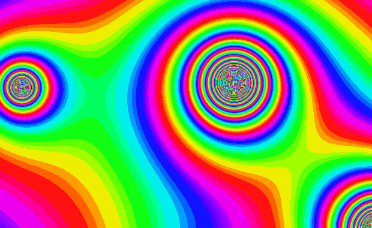

# metaballs

**Made with <3 by [stdmatt](http://stdmatt.com).**

<!--  -->
## Description:

    

Simple _"demo"_ created inspired in the amazing channel by
<a href="https://shiffman.net/">Daniel Shiffman's</a>
<a href="https://thecodingtrain.com/CodingChallenges/028-metaballs.html">Coding Train</a>.

You can see it running [here](http://stdmatt.com/deploy/demos/metaballs/index.html)

As usual, you are **very welcomed** to **share** and **hack** it.

<!--  -->
## Dependencies:

* [mcow_js_core](https://stdmatt.com/projects/libs/js/mcow_js_core.html)
* [mcow_js_canvas](https://stdmatt.com/projects/libs/js/mcow_js_canvas.html)

<!--  -->
## License:

This software is released under [GPLv3](https://www.gnu.org/licenses/gpl-3.0.en.html).

<!--  -->
## Others:

There's more FLOSS things at [stdmatt.com](https://stdmatt.com) :)
